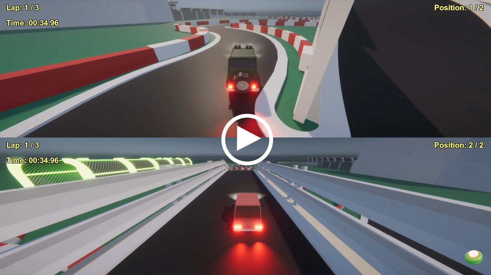

# Burning Clash
Split-screen racing game with powerups. A group (4 members) student project for the class "Virtual Environments".

# My contibutions

## Waypoint system
Implemented a waypoint system for tracking the cars' positions on the racetrack.

Red spheres on the image above represent the waypoints which follow the race track, and red lines represent segments which connect the adjacent waypoints. Green sphere shows the closest segment position of the SUV, while the white/gray sphere shows the closest segment position of the blue car. To determine the positions of the cars in the race, first the segments are compared and the farther segment is considered in the lead. If the cars are on the same segment of the track, then the percentage of segment completion is compared. In order to advance to the next segment, a car has to drive close enough to the final waypoint of the segment so that no part of the track can be skipped.

The waypoint system is also used for resetting the car onto the track - a player can at any point reset their car, which will then be moved to their current segment position.

## Powerups
Implemented the powerup system. Collision with a crate grants the player a random powerup: homing missile, mine or roadblock.

Powerup crate - each crate has a spawner, which respawns it at its location after a certain amount of time passes.

Homing missile - locks onto the first car in front of it and tries to follow it.

Mine - it's left behind a car, and remains on the track until a car collides with it.

Roadblock - an obstacle left behind a car. Has a lifespan after which it's automatically destroyed, to prevent completely blocking the path.

## Split-screen
Added the split-screen functionality for up to 4 players.

## GUI
Implemented a simple GUI for showing each player's position, time, lap and powerup.
